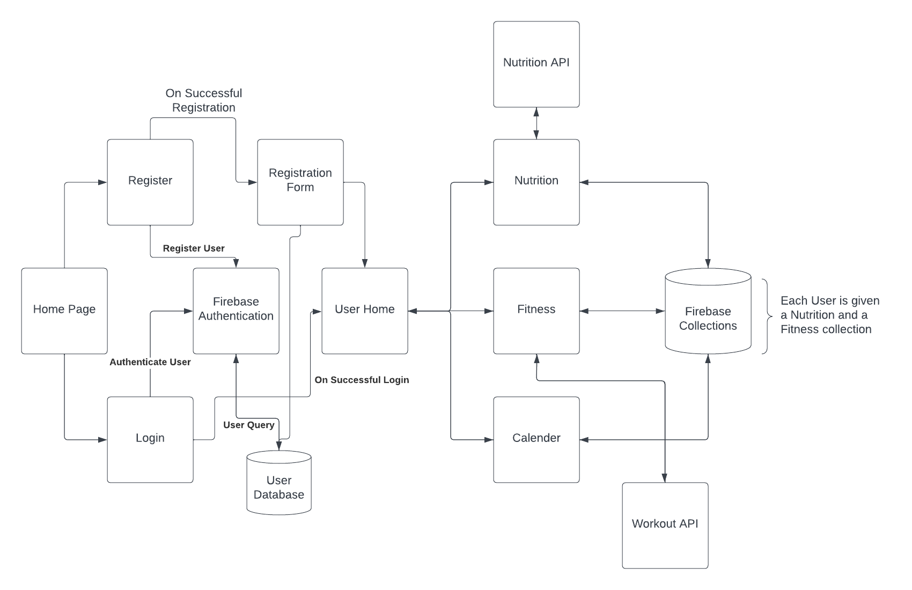

# Total Fitness

## Diagram



## Creators/Team

- Nicholas Szwed (Product Owner)
- Batu Asalih
- Phudis Rangsisuriyachai
- Vaibhav Honakere
- Julio Vasquez-Bonilla

# Registration

## Register.js

This component represents a user registration form. It allows users to create a new account by providing their personal information. The component uses the Material-UI library for styling and form elements.

### Dependencies

- React: `import * as React from "react"`
- Material-UI Components:
  - `Avatar` from `@mui/material/Avatar`
  - `Button` from `@mui/material/Button`
  - `CssBaseline` from `@mui/material/CssBaseline`
  - `TextField` from `@mui/material/TextField`
  - `FormControlLabel` from `@mui/material/FormControlLabel`
  - `Checkbox` from `@mui/material/Checkbox`
  - `Link` from `@mui/material/Link`
  - `Grid` from `@mui/material/Grid`
  - `Box` from `@mui/material/Box`
  - `LockOutlinedIcon` from `@mui/icons-material/LockOutlined`
  - `Typography` from `@mui/material/Typography`
  - `Container` from `@mui/material/Container`
  - `ThemeProvider` and `createTheme` from `@mui/material/styles`
  - `SelectInput` from `@mui/material/Select/SelectInput`
  - `useNavigate` from `react-router-dom`
- Firebase and Firestore:
  - `db` from `"../config/firebase"`
  - `collection`, `doc`, `setDoc`, and `addDoc` from `firebase/firestore`
  - `auth` from `"../config/firebase.js"`
  - `createUserWithEmailAndPassword` and `updateProfile` from `firebase/auth`

### Component Structure

The component is exported as the default component `Register()`. It returns JSX elements to render the registration form.

#### Function: `handleSubmit(event)`

This function handles the form submission event and is called when the user clicks the "Sign Up" button.

1. It prevents the default form submission behavior using `event.preventDefault()`.
2. It retrieves the user input from the form fields.
3. It calls the `createUserWithEmailAndPassword` function from Firebase authentication to register the user.
4. If registration is successful, it creates a new document in the Firestore collection "users" with the user's information using the `setDoc` function.
5. It updates the user's display name using the `updateProfile` function.
6. It displays an alert indicating successful user creation.
7. It uses the `history` object to navigate to the "/Start" page.
8. If there is an error during user creation, it logs the error details to the console.

#### JSX Structure

The component returns JSX elements to render the registration form using Material-UI components.

- `ThemeProvider` provides the theme for the component using the `theme` variable created with `createTheme`.
- `Container` represents the main container component for the form.
- `CssBaseline` resets the default styling of HTML elements.
- `Box` is used to group and align the form elements.
- `Avatar` displays the LockOutlinedIcon as an avatar for the registration form.
- `Typography` displays the "Sign up" heading.
- `form` is wrapped by a `Box` component.
- `Grid` is used for a responsive layout of form fields.
- `TextField` is used for input fields like first name, last name, email, and password.
- `FormControlLabel` displays a checkbox for receiving emails.
- `Button` is the "Sign Up" button that triggers the `handleSubmit` function on form submission.
- `Link` provides a link to the login page.
- `Copyright` displays

# Authentication

## Login.js

This component represents a user login form. It allows users to sign in to their account using their email and password. The component uses the Material-UI library for styling and form elements.

### Dependencies

- React: `import * as React from "react"`
- Material-UI Components:
  - `Avatar` from `@mui/material/Avatar`
  - `Button` from `@mui/material/Button`
  - `CssBaseline` from `@mui/material/CssBaseline`
  - `TextField` from `@mui/material/TextField`
  - `FormControlLabel` from `@mui/material/FormControlLabel`
  - `Checkbox` from `@mui/material/Checkbox`
  - `Link` from `@mui/material/Link`
  - `Paper` from `@mui/material/Paper`
  - `Box` from `@mui/material/Box`
  - `Grid` from `@mui/material/Grid`
  - `LockOutlinedIcon` from `@mui/icons-material/LockOutlined`
  - `Typography` from `@mui/material/Typography`
  - `createTheme` and `ThemeProvider` from `@mui/material/styles`
  - `useNavigate` from `react-router-dom`
- Other Imports:
  - `backgroundImage` (imported image file)
  - Firebase and Firestore:
    - `auth` from `"../config/firebase.js"`
    - `signInWithEmailAndPassword` from `firebase/auth`

### Component Structure

The component is exported as the default component `Login()`. It returns JSX elements to render the login form.

#### Function: `handleSubmit(event)`

This function handles the form submission event and is called when the user clicks the "Sign In" button.

1. It prevents the default form submission behavior using `event.preventDefault()`.
2. It retrieves the user's email and password from the form fields.
3. It calls the `signInWithEmailAndPassword` function from Firebase authentication to sign in the user.
4. If login is successful, it displays an alert indicating successful login.
5. It stores the user's unique identifier (`user.uid`) in the browser's local storage using `localStorage.setItem`.
6. It uses the `history` object to navigate to the "/UserHome" page.
7. If there is an error during login, it logs the error details to the console.

#### JSX Structure

The component returns JSX elements to render the login form using Material-UI components.

- `ThemeProvider` provides the theme for the component using the `theme` variable created with `createTheme`.
- `Grid` represents the main container for the form using Material-UI's grid system.
- `CssBaseline` resets the default styling of HTML elements.
- The first `Grid` item with `backgroundImage` displays a background image imported from `backgroundImage` file.
- The second `Grid` item displays the login form with a paper component.
- `Box` is used to group and align the form elements.
- `Avatar` displays the LockOutlinedIcon as an avatar for the login form.
- `Typography` displays the "Sign in" heading.
- `form` is wrapped by a `Box` component.
- `TextField` is used for input fields like email and password.
- `FormControlLabel` displays a checkbox for remembering the login.
- `Button` is the "Sign In" button that triggers the `handleSubmit` function on form submission.
- `Link` provides links for forgot password and sign up.
- `Copyright` displays the copyright information.

# Home Pages

## App.js

This component represents the main application component that handles routing and renders different pages based on the current URL. It uses the Material-UI and Firebase libraries for various functionalities.

### Dependencies

- React: `import React, { createContext } from "react"`
- React Router: `import { BrowserRouter as Router, Routes, Route } from "react-router-dom"`
- Firebase and Firestore:
  - `useAuthState` from `"react-firebase-hooks/auth"`
  - `auth` from `"./config/firebase"`
- Material-UI and MUI libraries:
  - `Box`, `Container`, `Paper`, `Typography` from `"@mui/material"`
  - `LocalizationProvider` from `"@mui/x-date-pickers"`
  - `AdapterDayjs` from `"@mui/x-date-pickers/AdapterDayjs"`
  - `experimental_extendTheme`, `Experimental_CssVarsProvider`, `THEME_ID` from `"@mui/material/styles"`
  - `CssVarsProvider` from `"@mui/joy/styles"`
- Other local imports:
  - `"./pages/Home"`
  - `"./pages/About"`
  - `"./pages/FitnessHome"`
  - `"./pages/user_pages/NutritionHome"`
  - `"./pages/user_pages/UserHome"`
  - `"./pages/user_pages/UserProfile"`
  - `"./containers/Login"`
  - `"./containers/Register"`
  - `"./containers/RegistrationP2"`
  - `"./pages/Summary"`
  - `"./pages/user_pages/components/SharedContext"`
  - `"./AuthenticatedRoute"`
  - `"./config/firebase"`

### Component Structure

The component is exported as the default component `App()`. It returns JSX elements to render the main application.

#### JSX Structure

The component returns JSX elements to render the main application using Material-UI components and React Router.

- `LocalizationProvider` provides the localization context for date pickers using `AdapterDayjs`.
- `MaterialCssVarsProvider` provides the Material-UI theme using `materialTheme` created with `experimental_extendTheme`.
- `JoyCssVarsProvider` provides the Joy UI theme.
- The main application is wrapped in a `div` with the class name "home".
- The routing is set up using `Router` from React Router.
- The routing components are defined within the `Routes` component.
- `SharedContext.Provider` provides the shared context for the user state.
- The routes are defined using `Route` components.
- The `Home` component is rendered as the default route.
- The `Summary`, `About`, `FitnessHome`, `NutritionHome`, `UserHome`, and `UserProfile` components are rendered as nested routes within the `Home` route.
- The `Login`, `Register`, and `RegistrationPart2` components are rendered as separate routes.
- The Firebase UI authentication container is rendered within a `div` with the id "firebaseui-auth-container".

## Home.js

This component represents the landing page of the website. It displays general information about the app and provides user login functionality. It also includes a navigation bar.

### Dependencies

- React: `import React, { useEffect } from "react"`
- Custom Component: `import NavBar from "../home_components/NavBar"`

### Component Structure

The component is exported as the default component `Home()`. It returns JSX elements to render the landing page.

#### JSX Structure

The component returns a single instance of the `NavBar` component.

## Navbar.js

The `NavBar` component represents the navigation bar of the website. It provides a menu button, navigation links, and user authentication options.

## Dependencies

- React: `import React, { useEffect, useRef } from "react"`
- Material-UI Components: `import { Button, IconButton, Typography, Box, AppBar, Toolbar, Menu, MenuItem } from "@mui/material"`
- Material-UI Icons: `import MenuIcon from "@mui/icons-material/Menu"`
- React Router: `import { Outlet, useNavigate } from "react-router-dom"`
- Firebase Authentication: `import { useContext } from "react"; import { getAuth, signOut } from "firebase/auth"; import SharedContext from "../pages/user_pages/components/SharedContext"`

## Usage

To use the `NavBar` component, follow these steps:

1. Import the necessary dependencies and the `NavBar` component into your React application.

```javascript
import React from "react";
import NavBar from "./NavBar";

function App() {
  return (
    <div>
      <h1>Your Application</h1>
      <NavBar />
      {/* Your application content */}
    </div>
  );
}

export default App;
```

### Functions

- `NavBar`
  - Creates a Navigation bar with links to `userHome.js`, `nutritionHome.js`, `fitnesshome.js`, and `userProfile.js`
- Sets up home page and the tool bar to navigate through the home pages.

## About.js

The `About.js` file contains the code for the About page of the application. It provides information about the application, including the frameworks used and other technical features.

- States goal of the project

## Summary.js

The `Summary.js` file contains the code for the summary page of the application. It provides an overview of the application's features and includes sections for home, about, services, and a footer.

- States goals and features
- High level overview

# User Pages

## UserHome.js

The `UserHome.js` file contains the code for the user home page of the application. It displays user profile information, a navigation menu, and content sections for nutrition, workout, and calendar.

## UserProfile.js

This component represents the user profile page in a React application. It allows users to view and edit their profile information.

### Dependencies

The following dependencies are imported:

- `AccountCircle` from `@mui/icons-material`: Material-UI icon component for displaying an account circle.
- `Style` from `@mui/icons-material`: Material-UI icon component for styling purposes.
- `Button` from `@mui/material`: Material-UI button component.
- `Dialog` from `@mui/material`: Material-UI dialog component for displaying a modal dialog.
- `DialogActions` from `@mui/material`: Material-UI component for rendering actions within a dialog.
- `DialogContent` from `@mui/material`: Material-UI component for rendering the content of a dialog.
- `DialogTitle` from `@mui/material`: Material-UI component for rendering the title of a dialog.
- `TextField` from `@mui/material`: Material-UI component for rendering text input fields.
- `display` from `@mui/system`: Material-UI utility for handling display properties.
- `React` from `react`: React library for building user interfaces.
- `useEffect` and `useState` from `react`: React hooks for managing side effects and component state.
- `UserProfile.css`: External CSS file for styling the user profile page.
- `getAuth` and `onAuthStateChanged` from `firebase/auth`: Firebase authentication functions for retrieving the current user and listening for authentication state changes.
- `UserDataTable` component: A custom component for displaying user data.
- `db` from ../../config/firebase: Database instance for Firestore.
- `collection`, `doc`, and `updateDoc` from `firebase/firestore`: Firestore functions for interacting with collections and documents.
  ### Constants
  - `auth`: The Firebase authentication instance retrieved using `getAuth()`.
  ### UserProfile Component
  The main component is defined as a function component named `UserProfile`. It manages the user profile information and provides functionality to edit the profile.
  #### State Variables
  - `open`: A boolean state variable that determines whether the dialog for editing the profile is open or closed.
  - `newUserName`: A string state variable that holds the new user name entered in the form.
  - `newWeight`: A string state variable that holds the new weight entered in the form.
  - `newBlurb`: A string state variable that holds the new blurb entered in the form.
  - `currentUser`: A variable that stores the current user object.

#### UseEffectHook

The `useEffect` hook is used to listen for authentication state changes. It runs only once when the component is mounted. Inside the hook, an `onAuthStateChanged` listener is set up to retrieve the current user and update the component state accordingly. If a user is logged in, their profile information is displayed. Otherwise, default values are used.

#### Event Handlers

- `handleOpen`: Event handler function that sets the `open` state variable to `true`, opening the profile edit dialog.
- `handleClose`: Event handler function that sets the `open` state variable to `false`, closing the profile edit dialog and refreshing the page.
- `handleFormSubmit`: Event handler function that handles the form submission when the user updates their profile. It updates the Firestore document corresponding to the current user with the new user name and weight values.
- `handleUserNameChange`: Event handler function that updates the `newUserName` state variable with the value entered in the user name input field.
- `handleWeightChange`: Event handler function that updates the `newWeight` state variable with the value entered in the weight input field.

### userDataTable.js

1. Imports necessary modules and components from external libraries.
2. Imports Firebase configuration from the `config/firebase` file.
3. Initializes Firebase authentication using `getAuth()`.
4. Defines the `UserDataTable` function component.
5. Sets up state using the `useState` hook to store the user data.
6. Uses the `useEffect` hook with an empty dependency array to fetch user data when the component mounts.
7. Within the `fetchData` async function, gets the currently authenticated user using `auth.currentUser`.
8. If a user exists, retrieves the user's document from the `users` collection in 9. 9.Firestore using `getDoc` and the user's UID.
9. If the user document exists, extracts the user data using `userDoc.data()` and sets the `userData` state.
10. Displays a loading spinner if `userData` is null.
11. Renders a table with user data if `userData` is available, showing weight goal, fitness goal, current weight, and height.

## NutritionHome.js

The following code is a React component named `NutritionHome` that represents a nutrition tracking application. It allows users to add and search for meals, view nutrition data in a pie chart, and display a nutrition table based on the selected date.

## Dependencies

The code requires the following dependencies:

- `PropTypes` from the `prop-types` package
- `SwipeableViews` from the `react-swipeable-views` package
- `useTheme` from the `@mui/material/styles` package
- `AppBar` from the `@mui/material/AppBar` package
- `Tabs` from the `@mui/material/Tabs` package
- `Tab` from the `@mui/material/Tab` package
- `React` from the `react` package
- `Typography` from the `@mui/material/Typography` package
- `Modal` from the `@mui/material/Modal` package
- `useEffect` and `useState` from the `react` package
- `NutritionTable` component from "./components/nutritionTable" file
- `auth`, `db`, `db_n` objects from "../../config/firebase" file
- `ModalDialog` from the `@mui/joy/ModalDialog` package
- `serverTimestamp` from the `firebase/firestore` package
- `getFirestore`, `collection`, `doc`, `getDoc`, and `setDoc` from the `firebase/firestore` package
- `getDatabase`, `ref`, and `set` from the `firebase/database` package
- `Box` from the `@mui/material/Box` package
- `Button` from the `@mui/material/Button` package
- `TextField` from the `@mui/material/TextField` package
- `AddIcon` from the `@mui/icons-material/Add` package
- `Grid` from the `@mui/joy` package
- `dayjs` from the `dayjs` package
- `utc` plugin from the `dayjs/plugin/utc` package
- `PieChartNutrition` component from "./components/pieChartMacros" file
- `DateCalendar` from the `@mui/x-date-pickers/DateCalendar` package

## Components

### TabPanel

This is a functional component that represents a tab panel in the application. It accepts the following props:

- `children`: The content of the tab panel.
- `value`: The current selected tab value.
- `index`: The index of the tab panel.

### a11yProps

This is a helper function that generates accessibility props for a tab. It accepts the following argument:

- `index`: The index of the tab.

### clear_box

This is a function that clears the input fields of the meal form.

### save

This is an asynchronous function that saves the meal data to the database. It retrieves the input values from the meal form and uses Firebase Firestore to store the meal information.

### NutritionHome

This is the main React component that represents the nutrition tracking application. It uses various components and hooks to manage the state and handle user interactions. The component renders a grid layout with buttons, a modal, a pie chart, and a nutrition table.

The component uses the following state variables:

- `data`: A state variable that holds an array of objects representing nutrition data.
- `selectedDate`: A state variable that holds the selected date.
- `open`: A state variable that determines whether the modal is open or closed.
- `value`: A state variable that holds the currently selected tab value.

The component provides the following functions:

- `handleOpen`: A function that opens the modal.
- `handleClose`: A function that closes the modal.
- `handleChange`: A function that handles tab change events.
- `handleChangeIndex`: A function that handles tab index change events.

The `NutritionHome` component renders the following elements:

- A button to add a meal.
- A modal dialog that contains two tabs: "My Meals" and "Search Meal".
- Inside the "My Meals" tab, a form to add meal data.
- A button to add the meal, which triggers the `save` function.
- A pie chart displaying the nutrition data.
- A date calendar to select a date.
- A `NutritionTable` component to display the nutrition table.

## Export

The `NutritionHome` component is exported as the default export of the module.

## Components

### nutriitonTable.js

The following code is a React component named `NutritionTable` that represents a nutrition table in a nutrition tracking application. It fetches and displays nutrition data from a Firestore database based on the selected date.

## Dependencies

The code requires the following dependencies:

- `useEffect` and `useState` from the `react` package
- `useNavigate` from the `react-router-dom` package
- `Table` and `Sheet` components from the `@mui/joy` package
- `db` object from the `../../../config/firebase` file
- `getDocs`, `collection`, `where`, `query`, `getDoc`, and `doc` functions from the `firebase/firestore` package
- `getAuth` and `onAuthStateChanged` functions from the `firebase/auth` package
- `DatePicker` component from the `@mui/x-date-pickers` package
- `Grid` component from the `@mui/joy` package
- `dayjs` from the `dayjs` package
- `utc` plugin from the `dayjs/plugin/utc` package
- `useContext` from the `react` package
- `SharedContext` component from "./SharedContext" file
- `CircularProgress` component from the `@mui/joy` package
- `Box` component from the `@mui/material/Box` package
- `useCollection` hook from the `react-firebase-hooks/firestore` package

## NutritionTable

This is a React component that represents a nutrition table in a nutrition tracking application. It accepts the following prop:

- `selectedDate`: The selected date for which the nutrition data should be fetched.

The component uses the following state variables:

- `nutrition`: A state variable that holds an array of objects representing nutrition data.
- `totals`: A state variable that holds the total nutrition values.
- `value`: A state variable that holds the Firestore collection query result.
- `loading`: A state variable that indicates whether the data is being loaded.
- `error`: A state variable that holds the error, if any.

The component provides the following functions:

- `useEffect`: A hook that fetches and sets the nutrition data, totals, and pie chart data based on the selected date.
- `return`: Renders the nutrition table, showing the meal details and the total nutrition values. If the data is still loading, it displays a loading spinner.

### workoutTable.js

````markdown
## Workouts Component

```jsx
function Workouts({ onWorkoutClick, selected, setSelected })
```
````

This component displays a list of workout exercises. It allows the user to select exercises and manage the selected exercises.

### Props

- `onWorkoutClick`: Function to handle the click event on a workout exercise.
- `selected`: Array of selected workout exercises.
- `setSelected`: Function to set the selected workout exercises.

## getContent Function

```jsx
function getContent(step, name, setName, days, setDays, frequency, setFrequency, selected, setSelected)
```

This function returns the content based on the current step in the workout creation process.

### Parameters

- `step`: Current step in the workout creation process.
- `name`: Name of the workout.
- `setName`: Function to set the name of the workout.
- `days`: Array of selected days for the workout schedule.
- `setDays`: Function to set the selected days for the workout schedule.
- `frequency`: Frequency of the workout schedule.
- `setFrequency`: Function to set the frequency of the workout schedule.
- `selected`: Array of selected workout exercises.
- `setSelected`: Function to set the selected workout exercises.

## PressableCardBoards Component

```jsx
function PressableCardBoards()
```

This component displays the workout plans and allows the user to add, edit, and remove workout plans.

### State

- `open`: Boolean value indicating whether the modal is open or not.
- `selected`: Array of selected workout exercises.
- `editMode`: String value indicating whether the component is in edit mode or not.
- `step`: Current step in the workout creation process.
- `name`: Name of the workout.
- `frequency`: Frequency of the workout schedule.
- `days`: Array of selected days for the workout schedule.
- `value`: Value of the Firestore collection for workout plans.
- `loading`: Boolean value indicating whether the Firestore collection is loading or not.
- `error`: Error message if there is an error with the Firestore collection.

### Methods

- `handleEditCard`: Handles the edit event for a workout plan.
- `handleClose`: Closes the modal and resets the component state.
- `finalizeSchedule`: Generates the schedule based on the selected days and frequency.
- `handleCardChange`: Handles the creation or update of a workout plan.
- `handleNextStep`: Proceeds to the next step in the workout creation process.
- `handleRemoveCard`: Handles the removal of a workout plan.

## Usage

To use the `PressableCardBoards` component, simply include it in your React application:

```jsx
<PressableCardBoards />
```

Make sure to import the necessary dependencies and set up the required context (e.g., `SharedContext`) for the component to work correctly.
